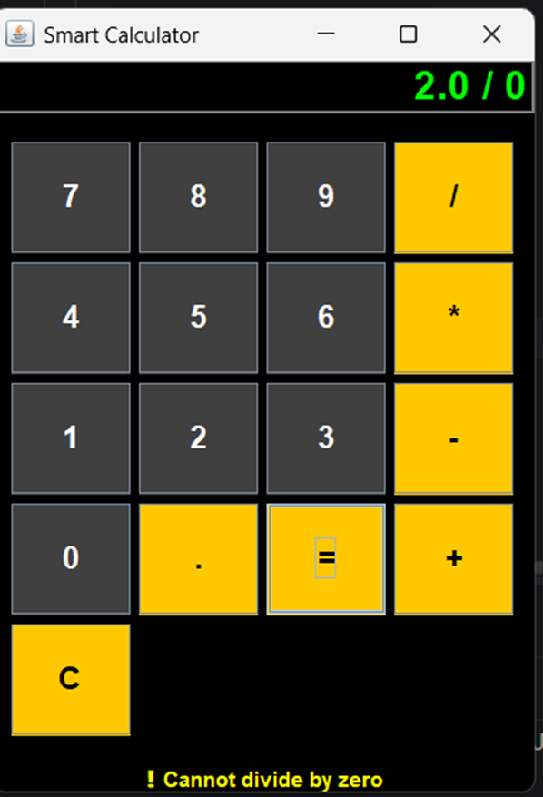

# Smart Accessible Calculator (Java)

## 📌 Overview

This project is a Smart Calculator developed using Java Swing.
It provides a user-friendly interface along with accessibility features like voice output and smooth button interaction.

---

## ✨ Features

* Basic arithmetic operations (+, -, *, /)
* Voice output for numbers and results
* Smooth animated buttons (mobile-style feel)
* Error handling (invalid input, divide by zero)
* Welcome screen
* History screen (second page)
* Sound feedback on button press

---

## 🛠️ Technologies Used

* Java
* Swing (GUI)
* AWT

---

## ▶️ How to Run

1. Install Java (JDK 8 or above)
2. Compile the program:

   ```
   javac CalculatorApp.java
   ```
3. Run the program:

   ```
   java CalculatorApp
   ```

---

## 📸 Screenshots

(Add your screenshots here if you upload them)

---

## 📚 What I Learned

* Building GUI applications using Java Swing
* Handling events using ActionListener
* Designing user-friendly interfaces
* Implementing error handling
* Adding accessibility features like voice output

## 📸 Screenshots



---

## 👩‍💻 Author

ARCHANA M
